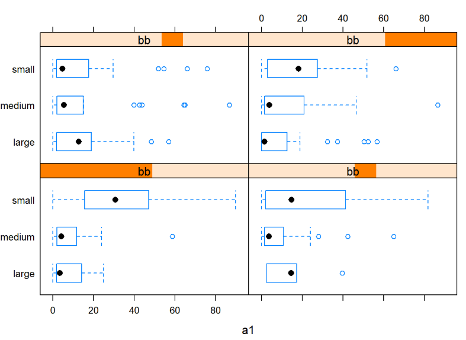
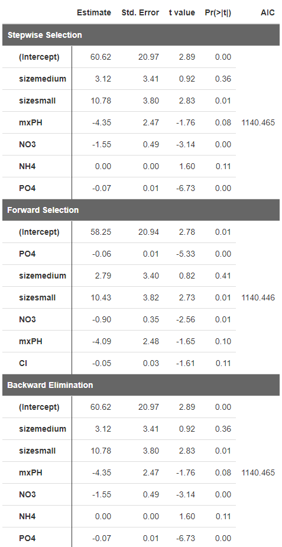
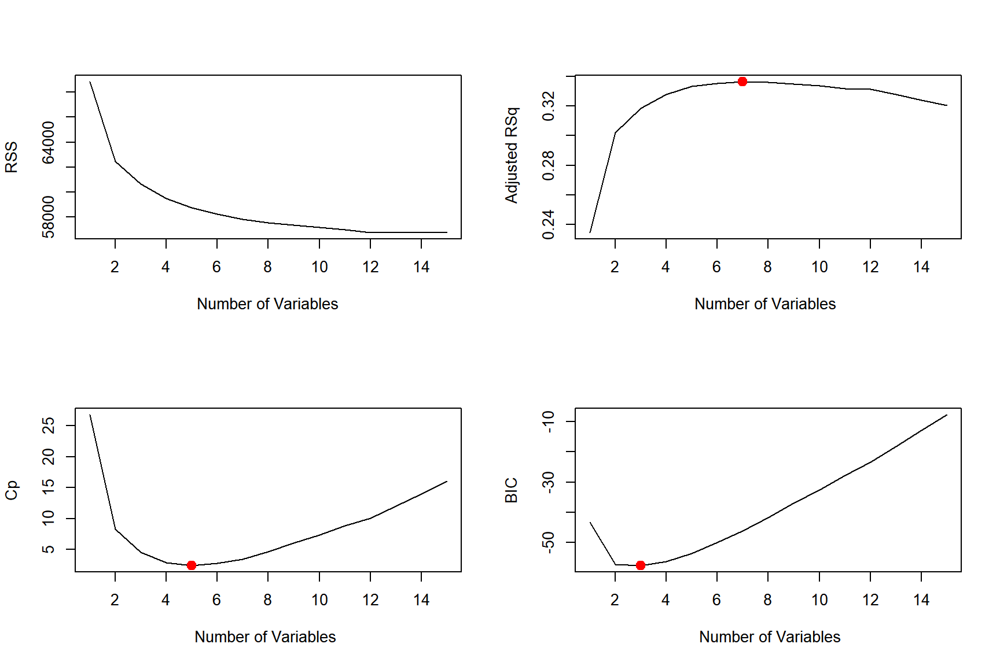

## Datamining

### 1. bwplot & stripplot

    

  

* how to draw bwplot and stripplot 
    
### 2. Handling missing values
* Ways to handle missing values
    + fill the values using `mean`
    + fill the values using `median`
    + fit values using a simple linear model
    + use observations that have the shortest distance `cluster::daisy`  
     
### 3. Linear model selection
   

* Forward Selection
* Backward Elimination
* Stepwise
* Regsubsets  `leaps::regsubsets`  
