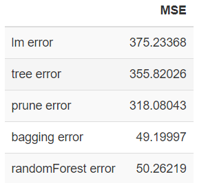

## Datamining

### 1. bwplot & stripplot

    

  

* how to draw bwplot and stripplot 
 
    
### 2. Handling missing values
* Ways to handle missing values
    + fill the values using `mean`
    + fill the values using `median`
    + fit values using a simple linear model
    + use observations that have the shortest distance `cluster::daisy`  
 

### 3. Linear model selection
   

* Forward Selection
* Backward Elimination
* Stepwise
* Regsubsets  `leaps::regsubsets`  
 

### 4. Tree
 

* How to find the best TREE using `cv.tree` and `prune.tree`
* Use `randomForest::randomForest` to apply **bagging** and **randomForest** methods
* Compare the MSE of various methods
 

### 5. LDA & QDA

    

  

* perform `LDA` and `QDA` using
    + *iris* data
    + *Smarket* data (**ISLR** package)
    
